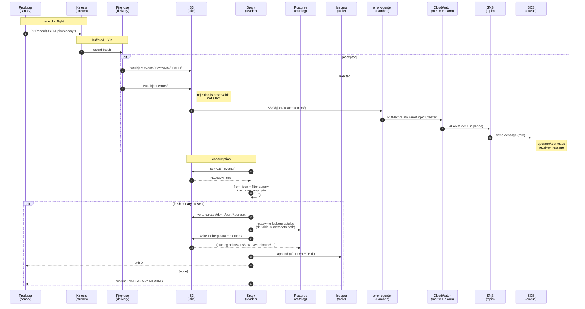

# Sample project on using Kinesis with Spark

```mermaid
sequenceDiagram
    autonumber
    participant SRC as Producer<br/>(canary)
    participant STR as Kinesis<br/>(stream)
    participant DL as Firehose<br/>(delivery)
    participant LAK as S3<br/>(lake)
    participant RD as Spark<br/>(reader)
    participant PG as Postgres<br/>(catalog)
    participant TBL as Iceberg<br/>(table)
    participant CNT as error-counter<br/>(Lambda)
    participant CW as CloudWatch<br/>(metric + alarm)
    participant SNS as SNS<br/>(topic)
    participant SQS as SQS<br/>(queue)

    Note over SRC,STR: record in flight
    SRC->>STR: PutRecord(JSON, pk="canary")

    Note over STR,DL: buffered ~60s
    STR->>DL: record batch
    alt accepted
        DL->>LAK: PutObject events/YYYY/MM/DD/HH/…
    else rejected
        DL->>LAK: PutObject errors/…
        Note right of LAK: rejection is observable,<br/>not silent
        LAK->>CNT: S3 ObjectCreated (errors/)
        CNT->>CW: PutMetricData ErrorObjectCreated
        CW->>SNS: ALARM (>= 1 in period)
        SNS->>SQS: SendMessage (raw)
        Note right of SQS: operator/test reads<br/>receive-message
    end

    Note over RD,LAK: consumption
    RD->>LAK: list + GET events/
    LAK-->>RD: NDJSON lines
    RD->>RD: from_json + filter canary<br/>+ to_timestamp gate
    alt fresh canary present
        RD->>LAK: write curated/dt=…/part-*.parquet
        RD->>PG: read/write Iceberg catalog<br/>(db.table -> metadata path)
        RD->>LAK: write Iceberg data + metadata
        LAK-->>PG: (catalog points at s3a://…/warehouse/…)
        RD->>TBL: append (after DELETE dt)
        RD-->>SRC: exit 0
    else none
        RD-->>SRC: RuntimeError CANARY MISSING
    end
```